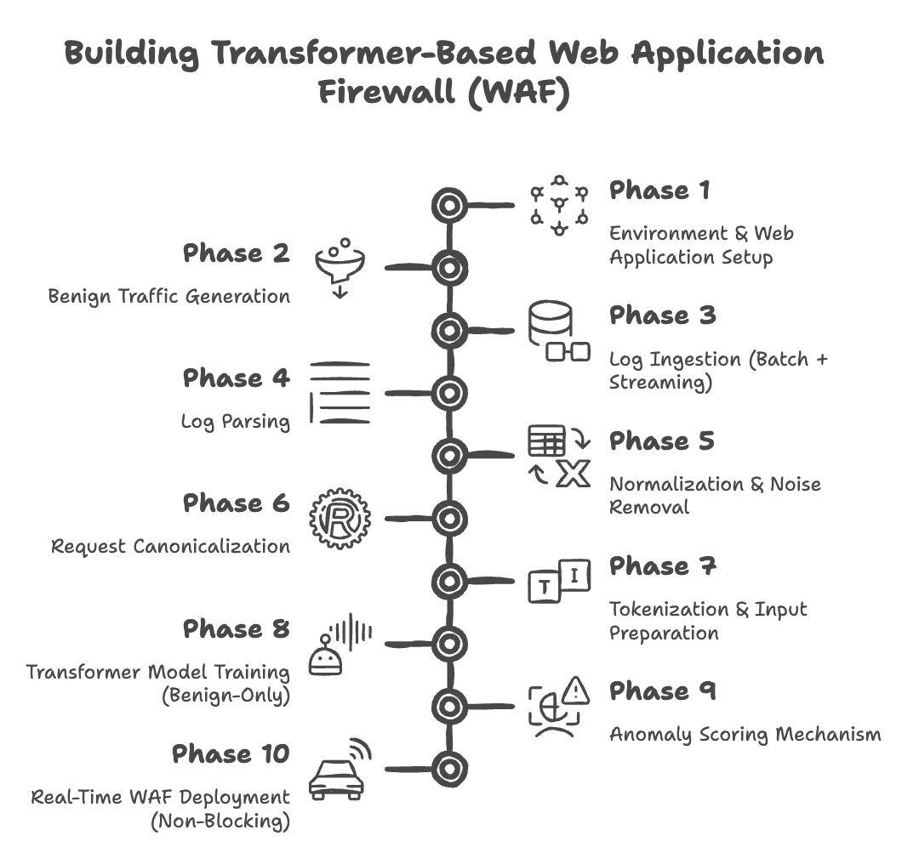

# Transformer-Based Web Application Firewall (WAF)

## Problem Statement

Most Web Application Firewalls work using fixed rules and known attack patterns. These rules do not change easily and fail when new or unknown attacks appear. If an attacker changes the payload or uses a new method, traditional WAFs often cannot detect it.

Modern web applications receive many different types of requests with dynamic values like IDs, tokens, and timestamps. Writing rules for every case is difficult and not scalable.

The goal of this problem is to build a smarter Web Application Firewall that learns normal web traffic by itself using a Transformer model. The system should detect abnormal requests in real time, work alongside Apache or Nginx, and not block normal traffic.

**SIH Problem ID : 25172**

Datasets I will be using - 
- https://www.sac.gov.in/files/sih/ps-04-data.pdf
- https://github.com/mitre-attack/attack-stix-data.git


## Team Details

**Team Member:**

* Rishit Laddha
* App ID: 2309575


## Proposed Solution



The solution is a Transformer-based Web Application Firewall that learns how normal web requests look and then detects requests that look different. The solution I am proposing extends beyond the base SIH problem statement and completes the full security pipeline required for a real-world Web Application Firewall.

First, the three given web applications are deployed behind Apache or Nginx. These applications are used only to generate normal user traffic. Common actions like browsing pages, logging in, searching, and submitting forms are performed. No attacks are sent at this stage. This creates access logs that contain only benign requests.

Next, the access logs are collected in two ways. Old log files are read for training, and live logs are continuously read while the application is running. This allows the system to work with both past data and real-time traffic.

After collecting the logs, each log entry is parsed to extract useful information such as the HTTP method, URL path, query parameters, status code, and user-agent. Since many requests contain dynamic values, these values are cleaned and replaced with placeholders. For example, user IDs, timestamps, tokens, and random numbers are replaced with common symbols. This helps the model focus on request patterns instead of exact values.

Each cleaned request is then converted into a single text line that represents the request in a standard way. This text is broken into tokens so that it can be used as input for a Transformer model.

The Transformer model is trained using only benign requests. It is trained in a self-learning way where the model learns normal request structure and sequence patterns without needing labels. Over time, the model learns what normal web traffic looks like.

Once the model is trained, it is connected to the web server as a separate service. Every new incoming request is sent to the model in real time. The model checks how different the request is from normal behavior and assigns an anomaly score. Requests with high anomaly scores are marked as suspicious. This process is done asynchronously so that normal traffic is not delayed.

When a request is detected as suspicious, the system analyzes the request pattern and maps it to relevant MITRE ATT&CK techniques. This step helps explain what type of attack the request may belong to, such as SQL injection or path traversal. This mapping is done after detection and does not affect model training.

The system also supports updates over time. As new normal traffic is generated, the model can be fine-tuned using this new data without training again from scratch. This allows the WAF to adapt to changes in application behavior.

Overall, this solution removes dependency on fixed rules, improves detection of unknown attacks, and provides a practical and explainable Web Application Firewall for modern web applications.

## Initial Tech Stack Proposed

| Layer / Purpose        | Technology                          | Reason                                               |
| ---------------------- | ----------------------------------- | ---------------------------------------------------- |
| Web Applications       | DVWA, OWASP Juice Shop, WebGoat     | Used to generate realistic benign web traffic        |
| Web Server             | Apache / Nginx                      | Provides real access logs and real-time request flow |
| Log Collection         | File-based logs, `tail -F`          | Simple and reliable log ingestion                    |
| Log Ingestion          | Python                              | Easy to handle batch and streaming logs              |
| Log Parsing            | Python (regex / structured parsing) | Extracts method, URL, params, status, headers        |
| Data Storage           | JSON / JSONL                        | Lightweight and easy to process                      |
| Normalization          | Python                              | Removes dynamic values like IDs and tokens           |
| Tokenization           | Hugging Face Tokenizers             | Converts requests into model-readable tokens         |
| Transformer Model      | Hugging Face Transformers           | Open-source and flexible for training                |
| Model Training         | PyTorch                             | Efficient training and fine-tuning                   |
| Anomaly Detection      | Loss / Perplexity based scoring     | Works with benign-only training                      |
| Real-Time Inference    | FastAPI                             | Non-blocking model serving                           |
| Web Server Integration | Sidecar microservice                | Avoids blocking Apache/Nginx                         |
| MITRE ATT&CK Mapping   | MITRE ATT&CK Framework              | Explains detected attack patterns                    |
| Continuous Learning    | PyTorch fine-tuning scripts         | Incremental updates without full retraining          |
| Demo & Testing         | curl, custom scripts                | Injects test payloads during evaluation              |

## Current Progress

- **Data pipeline**: Nginx access logs are parsed (`parser/parse_nginx_logs.py`), normalized, and converted into token sequences (`tokenizer/tokenize_requests.py`). A vocabulary and dataset loader (`model/vocab.py`, `model/dataset.py`, `model/config.py`) are implemented for a Transformer-based autoencoder.
- **Traffic generation**: Locust scripts under `traffic/` generate benign traffic for DVWA, Juice Shop and WebGoat, closing the loop from apps → logs → tokens.
- **Security tooling integration (MCP Kali Server)**: The `MCP-Kali-Server/` module is wired so that a Kali box can be exposed as an MCP toolset. The Flask API (`server.py`) now also exposes `/mcp/capabilities` and `/mcp/tools/kali_tools/<tool_name>` endpoints, and the MCP client (`client.py`) registers tools like `nmap_scan`, `gobuster_scan`, `sqlmap_scan`, `hydra_attack`, etc. This allows an AI agent to pivot from anomaly detection into active recon or exploitation steps directly against the same targets.

## Future Scope

- **Tight loop between WAF and Kali MCP tools**: When the model flags a high‑anomaly request, automatically invoke selected MCP Kali tools (e.g., `nmap_scan` for service discovery, `sqlmap_scan` for suspected SQLi) to validate and enrich the alert with additional context.
- **Automated playbooks**: Define higher‑level “response recipes” that chain multiple MCP tools (recon → exploitation attempt → impact assessment) and feed the results back into the WAF’s alerting and reporting layer.
- **Feedback into the model**: Use MCP Kali outputs as weak labels (e.g., confirmed SQLi, directory brute‑force) to periodically fine‑tune the Transformer and improve detection thresholds and feature representations.
- **Multi‑agent collaboration**: Combine the anomaly model, a reasoning agent, and the MCP Kali server into a coordinated system where one agent monitors traffic, another plans an investigation, and the Kali MCP tools execute concrete security actions under policy constraints.

---

# MCP Kali Server

**MCP Kali Server (MKS)** is a lightweight API bridge that connects [MCP clients](https://modelcontextprotocol.io/clients) (e.g: [Claude Desktop](https://code.claude.com/docs/en/desktop) or [5ire](https://github.com/nanbingxyz/5ire)) to the [API server](https://modelcontextprotocol.io/examples) which allows executing commands on a Linux terminal.

This MCP is able to run terminal commands as well as interacting with web applications using:

- `Dirb`
- `enum4linux`
- `gobuster`
- `Hydra`
- `John the Ripper`
- `Metasploit-Framework`
- `Nikto`
- `Nmap`
- `sqlmap`
- `WPScan`
- As well as being able to execute raw commands.

As a result, this is able to perform **AI-assisted penetration testing** and solving **CTF challenges** in real time.


## 🔍 Use Case

The goal is to enable AI-driven offensive security testing by:

- Letting the MCP interact with AI endpoints like [OpenAI](https://openai.com/), [Claude](https://claude.ai/), [DeepSeek](https://www.deepseek.com/), [Ollama](https://docs.ollama.com/) or any other models.
- Exposing an API to execute commands on a [Kali](https://www.kali.org/) machine.
- Using AI to suggest and run terminal commands to [solve CTF challenges] or automate recon/exploitation tasks.
- Allowing MCP apps to send custom requests (e.g. `curl`, `nmap`, `ffuf`, etc.) and receive structured outputs.

Here are some examples (using Google's AI `gemini 2.0 flash`):

### Example solving a web CTF challenge from RamadanCTF

https://drive.google.com/file/d/1LhToW1X4DoJMRezhrJa-c-8nH__E6W-g/view?usp=share_link

### Trying to solve machine "code" from HTB

https://drive.google.com/file/d/1pJ0JHCokHbTdfUpVGRwUVV6panFhQ7MO/view?usp=share_link

---

## 🚀 Features

- 🧠 **AI Endpoint Integration**: Connect your Kali to any MCP of your liking such as Claude Desktop or 5ire.
- 🖥️ **Command Execution API**: Exposes a controlled API to execute terminal commands on your Kali Linux machine.
- 🕸️ **Web Challenge Support**: AI can interact with websites and APIs, capture flags via `curl` and any other tool the AI needs.
- 🔐 **Designed for Offensive Security Professionals**: Ideal for red teamers, bug bounty hunters, or CTF players automating common tasks.

---

## 🛠️ Installation and Running

### On your Kali Machine

```bash
sudo apt install mcp-kali-server
kali-server
```

Otherwise for **bleeding edge**:

```bash
git clone https://github.com/Wh0am123/MCP-Kali-Server.git
cd MCP-Kali-Server
python3 -m venv .venv
source .venv/bin/activate
pip install -r requirements.txt
./server.py
```

**Command Line Options**:

- `--ip <address>`: Specify the IP address to bind the server to (default: `127.0.0.1` for localhost only)
  - Use `127.0.0.1` for local connections only (secure, recommended)
  - Use `0.0.0.0` to allow connections from any network interface (very dangerous; use with caution)
  - Use a specific IP address to bind to a particular network interface
- `--port <port>`: Specify the port number (default: `5000`)
- `--debug`: Enable debug mode for verbose logging

**Examples**:

```bash
# Run on localhost only (secure, default)
./server.py

# Run on all interfaces (less secure, useful for remote access)
./server.py --ip 0.0.0.0

# Run on a specific IP and custom port
./server.py --ip 192.168.1.100 --port 8080

# Run with debug mode
./server.py --debug
```

### On your MCP client machine

This can be local (on the same Kali machine) or remote (another Linux machine, Windows or macOS).

If you're running the client and server on the same _Kali_ machine (aka local), run either:

```bash
## OS package
mcp-server --server http://127.0.0.1:5000

# ...OR...

## Bleeding edge
./client.py --server http://127.0.0.1:5000
```

---

If separate machines (aka remote), create an SSH tunnel to your MCP server, then launch the client:

```bash
## Terminal 1 - Replace `LINUX_IP` with Kali's IP
ssh -L 5000:localhost:5000 user@LINUX_IP

## Terminal 2
git clone https://github.com/Wh0am123/MCP-Kali-Server.git
cd MCP-Kali-Server
python3 -m venv .venv
source .venv/bin/activate
pip install -r requirements.txt
./client.py --server http://127.0.0.1:5000
```

---

If you're openly hosting the MCP Kali server on your network (`server.py --ip ...`), you don't need the SSH tunnel (but we do recommend it!).

NOTE: ⚠️ (THIS IS STRONGLY DISCOURAGED. WE RECOMMEND SSH) ⚠️

```bash
./client.py --server http://LINUX_IP:5000
```

#### Configuration for Claude Desktop

Edit:

- macOS: `~/Library/Application Support/Claude/claude_desktop_config.json`

## 🔮 Other Possibilities

There are more possibilities than described since the AI model can now execute commands on the terminal. Here are some examples:

- **Make a ai pentesting automation tool that one can run locally and get reports on each run just like shannon ai**
 - 

