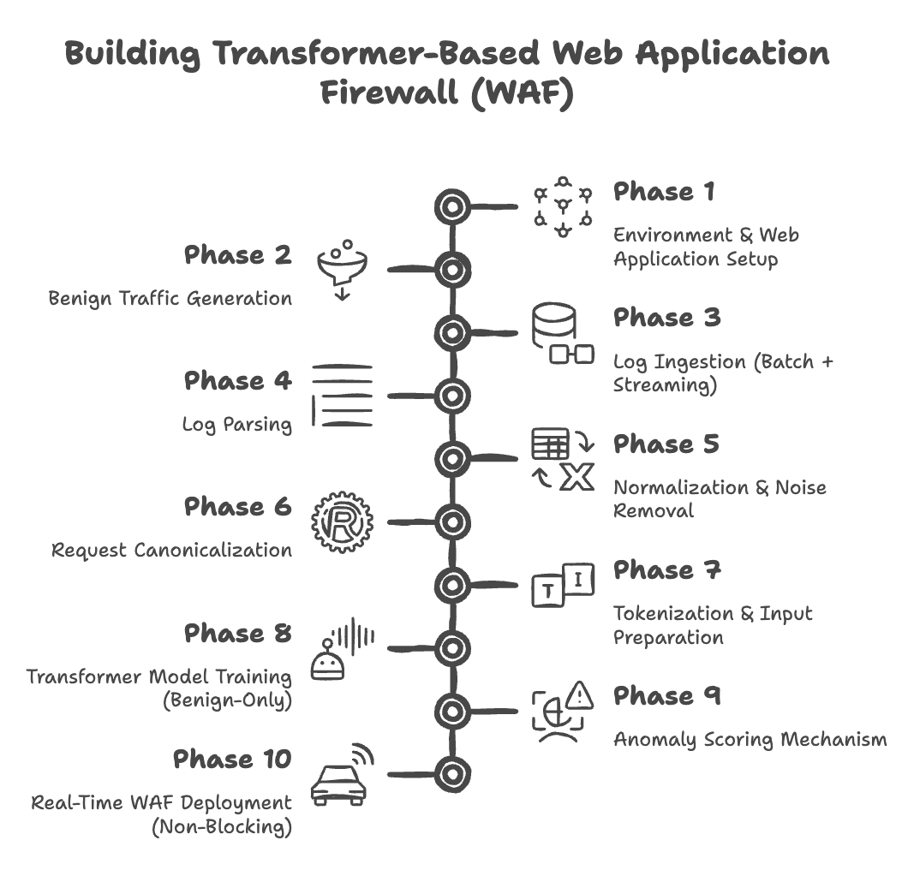

# Transformer-Based Web Application Firewall (WAF)

## Problem Statement

Most Web Application Firewalls work using fixed rules and known attack patterns. These rules do not change easily and fail when new or unknown attacks appear. If an attacker changes the payload or uses a new method, traditional WAFs often cannot detect it.

Modern web applications receive many different types of requests with dynamic values like IDs, tokens, and timestamps. Writing rules for every case is difficult and not scalable.

The goal of this problem is to build a smarter Web Application Firewall that learns normal web traffic by itself using a Transformer model. The system should detect abnormal requests in real time, work alongside Apache or Nginx, and not block normal traffic.

**SIH Problem ID : 25172**

Datasets I will be using - 
- https://www.sac.gov.in/files/sih/ps-04-data.pdf
- https://github.com/mitre-attack/attack-stix-data.git

## Team Details

**Team Member:**

* Rishit Laddha
* App ID: 2309575

## Proposed Solution

The solution is a Transformer-based Web Application Firewall that learns how normal web requests look and then detects requests that look different. The solution I am proposing extends beyond the base SIH problem statement and completes the full security pipeline required for a real-world Web Application Firewall.

First, the three given web applications are deployed behind Apache or Nginx. These applications are used only to generate normal user traffic. Common actions like browsing pages, logging in, searching, and submitting forms are performed. No attacks are sent at this stage. This creates access logs that contain only benign requests.

Next, the access logs are collected in two ways. Old log files are read for training, and live logs are continuously read while the application is running. This allows the system to work with both past data and real-time traffic.

After collecting the logs, each log entry is parsed to extract useful information such as the HTTP method, URL path, query parameters, status code, and user-agent. Since many requests contain dynamic values, these values are cleaned and replaced with placeholders. For example, user IDs, timestamps, tokens, and random numbers are replaced with common symbols. This helps the model focus on request patterns instead of exact values.

Each cleaned request is then converted into a single text line that represents the request in a standard way. This text is broken into tokens so that it can be used as input for a Transformer model.

The Transformer model is trained using only benign requests. It is trained in a self-learning way where the model learns normal request structure and sequence patterns without needing labels. Over time, the model learns what normal web traffic looks like.

Once the model is trained, it is connected to the web server as a separate service. Every new incoming request is sent to the model in real time. The model checks how different the request is from normal behavior and assigns an anomaly score. Requests with high anomaly scores are marked as suspicious. This process is done asynchronously so that normal traffic is not delayed.

When a request is detected as suspicious, the system analyzes the request pattern and maps it to relevant MITRE ATT&CK techniques. This step helps explain what type of attack the request may belong to, such as SQL injection or path traversal. This mapping is done after detection and does not affect model training.

The system also supports updates over time. As new normal traffic is generated, the model can be fine-tuned using this new data without training again from scratch. This allows the WAF to adapt to changes in application behavior.

Overall, this solution removes dependency on fixed rules, improves detection of unknown attacks, and provides a practical and explainable Web Application Firewall for modern web applications.

## Initial Tech Stack Proposed

| Layer / Purpose        | Technology                          | Reason                                               |
| ---------------------- | ----------------------------------- | ---------------------------------------------------- |
| Web Applications       | DVWA, OWASP Juice Shop, WebGoat     | Used to generate realistic benign web traffic        |
| Web Server             | Apache / Nginx                      | Provides real access logs and real-time request flow |
| Log Collection         | File-based logs, `tail -F`          | Simple and reliable log ingestion                    |
| Log Ingestion          | Python                              | Easy to handle batch and streaming logs              |
| Log Parsing            | Python (regex / structured parsing) | Extracts method, URL, params, status, headers        |
| Data Storage           | JSON / JSONL                        | Lightweight and easy to process                      |
| Normalization          | Python                              | Removes dynamic values like IDs and tokens           |
| Tokenization           | Hugging Face Tokenizers             | Converts requests into model-readable tokens         |
| Transformer Model      | Hugging Face Transformers           | Open-source and flexible for training                |
| Model Training         | PyTorch                             | Efficient training and fine-tuning                   |
| Anomaly Detection      | Loss / Perplexity based scoring     | Works with benign-only training                      |
| Real-Time Inference    | FastAPI                             | Non-blocking model serving                           |
| Web Server Integration | Sidecar microservice                | Avoids blocking Apache/Nginx                         |
| MITRE ATT&CK Mapping   | MITRE ATT&CK Framework              | Explains detected attack patterns                    |
| Continuous Learning    | PyTorch fine-tuning scripts         | Incremental updates without full retraining          |
| Demo & Testing         | curl, custom scripts                | Injects test payloads during evaluation              |

